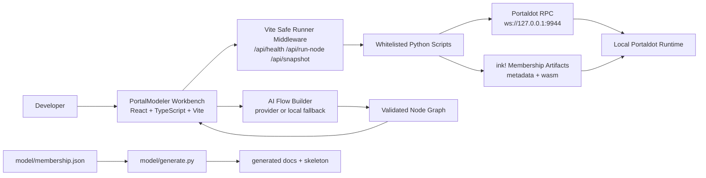
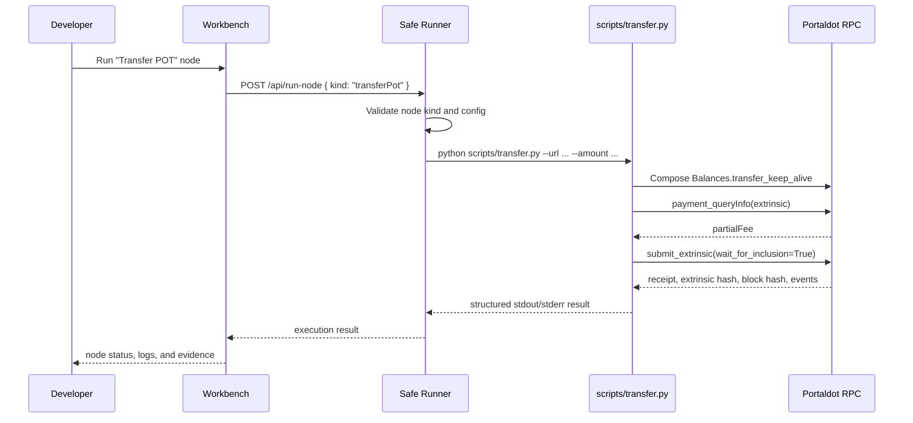
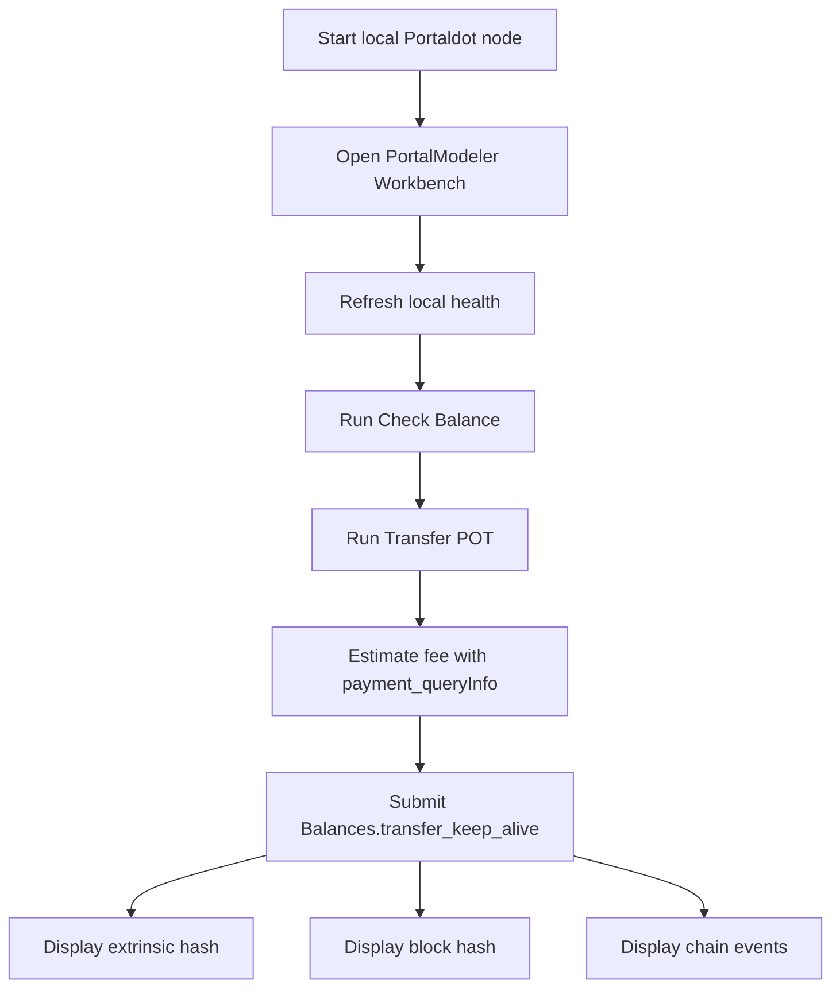

# PortalModeler


**PortalModeler is a visual execution workbench for Portaldot developers.**

It turns local blockchain operations into explicit, runnable canvas nodes: connect to a local Portaldot node, inspect account state, estimate POT fees, submit a transaction, read contract state, and export reproducible command artifacts. The goal is not to hide the chain behind a pretty UI. The goal is to make every step visible, repeatable, and inspectable.

The core proof is intentionally small and real:

```txt
Connect local Portaldot RPC
-> query Alice's POT balance
-> estimate fee through payment_queryInfo
-> submit Balances.transfer_keep_alive
-> display extrinsic hash, block hash, and chain events
```

The repository also includes an ink! Membership contract workflow and a model-to-skeleton generator as the forward path for contract-oriented visual development.

## Table Of Contents

- [What It Proves](#what-it-proves)
- [Product Capabilities](#product-capabilities)
- [Architecture](#architecture)
- [Repository Layout](#repository-layout)
- [Quick Start](#quick-start)
- [Run The Workbench](#run-the-workbench)
- [Core Demo Flow](#core-demo-flow)
- [Safe Runner API](#safe-runner-api)
- [AI Flow Builder](#ai-flow-builder)
- [Extended Contract Workflow](#extended-contract-workflow)
- [Model Generator](#model-generator)
- [Project Boundaries](#project-boundaries)
- [Troubleshooting](#troubleshooting)

## What It Proves

PortalModeler demonstrates a complete local Portaldot action from a visual node to on-chain evidence:

| Proof point | Implementation |
|---|---|
| RPC connectivity | `scripts/doctor.py` checks the local WebSocket endpoint. |
| Account state | `scripts/query.py` reads `System.Account`. |
| Fee estimation | `scripts/transfer.py` calls `payment_queryInfo` before submission. |
| State-changing action | `scripts/transfer.py` submits `Balances.transfer_keep_alive`. |
| Evidence capture | The receipt returns success state, extrinsic hash, block hash, and events. |
| Visual execution | `front-end/src/App.tsx` renders and runs the workflow nodes. |
| Safe local bridge | `front-end/vite.config.ts` exposes whitelisted Vite middleware endpoints. |

A successful transfer run produces evidence in this shape:

```txt
Endpoint: ws://127.0.0.1:9944
Sender: <Alice SS58 address>
Recipient: <Bob SS58 address>
Amount: 1000000000000 base units (0.010000 POT)
Estimated fee: <partialFee> base units
Fee source: payment_queryInfo RPC
Success: True
Extrinsic: <extrinsic hash>
Block hash: <block hash>
Events:
- Balances.Transfer
- TransactionPayment.TransactionFeePaid
- System.ExtrinsicSuccess
```

## Product Capabilities

| Area | Status | Notes |
|---|---:|---|
| Local Portaldot connection | Ready | Targets `ws://127.0.0.1:9944`. |
| Balance query | Ready | Reads `System.Account` through `substrate-interface`. |
| POT fee estimate | Ready | Uses `payment_queryInfo` before transaction submission. |
| Real on-chain transfer | Ready | Submits `Balances.transfer_keep_alive`. |
| Visual node workbench | Ready | Canvas, inspector, logs, output panels, status states, and import/export tools. |
| Safe local runner | Ready | Browser sends approved node kinds; middleware maps them to explicit commands. |
| Developer diagnostics | Ready | Metadata explorer, transaction preview, dry-run call, state diff, and error decoder nodes. |
| AI Flow Builder | Prototype-ready | Optional provider-backed planner with schema validation and deterministic fallback. |
| ink! Membership workflow | Extended | Build, deploy, call, and read scripts are included for contract exploration. |
| Model generator | Prototype | JSON contract/action model generates docs and contract skeleton artifacts. |

## Why This Matters

Local blockchain work often breaks in small, expensive ways: a stale endpoint, a missing artifact, a contract address from an old temporary chain, an unknown fee, or a script whose output no longer matches the current runtime. PortalModeler moves those failure points onto the board.

The project is built around five principles:

- **Visual first:** each operation is represented as a node with status, config, command preview, and logs.
- **Proof oriented:** the primary demo submits a real local Portaldot transaction and returns chain evidence.
- **Safe by design:** the browser cannot execute arbitrary shell commands.
- **Model aware:** structured models can generate docs, checklists, and starter contract code.
- **Extensible:** the same runner pattern can grow from token actions into contract lifecycle workflows.

## Architecture



### Runtime Execution Model



## Repository Layout

```txt
portaldot-proof/
|-- README.md                         # Main project documentation
|-- DEMO_FLOW.md                      # Recommended demo narrative and evidence notes
|-- WORKBENCH_USER_GUIDE.md           # Beginner-facing workbench guide
|-- PROGRESS_REVIEW_SUBMISSION.md     # Review notes and submission context
|-- requirements.txt                  # Python dependencies
|-- contract-address.txt              # Latest local contract address when deployed
|
|-- scripts/
|   |-- common.py                     # Shared RPC, keypair, and CLI helpers
|   |-- doctor.py                     # Environment and local runtime readiness checks
|   |-- query.py                      # Connect and query account balance
|   |-- transfer.py                   # Estimate fee and submit Transfer POT
|   |-- run_node.py                   # Local node launcher/log bridge helper
|   |-- deploy.py                     # Deploy ink! Membership contract artifacts
|   `-- call.py                       # Call/read Membership contract messages
|
|-- front-end/
|   |-- package.json                  # React/Vite app scripts and dependencies
|   |-- vite.config.ts                # Vite config plus safe-runner middleware
|   |-- index.html
|   `-- src/
|       |-- App.tsx                   # Main workbench, graph logic, planner, runner UI
|       |-- main.tsx
|       |-- styles.css
|       `-- assets/                   # PortalModeler images and logos
|
|-- contract/
|   |-- Cargo.toml                    # ink! Membership contract package
|   |-- rust-toolchain.toml
|   `-- src/
|       |-- lib.rs
|       `-- membership_contract.rs
|
|-- model/
|   |-- membership.json               # Contract/action model
|   `-- generate.py                   # Model -> docs/skeleton generator
|
`-- generated/
    |-- README.md
    |-- ACTIONS.md
    |-- EVENTS.md
    |-- DEPLOY_CHECKLIST.md
    `-- lib.rs
```

## Technology Stack

| Layer | Technology |
|---|---|
| Frontend | React 19, TypeScript 5, Vite 5, CSS, Lucide icons |
| Local runner | Vite middleware, Node.js child process execution, explicit command whitelist |
| Chain scripting | Python, `substrate-interface` |
| Chain target | Local Portaldot/Substrate-compatible node over WebSocket |
| Contract | Rust, ink! 5.0.2, `cargo-contract` |
| Modeling | JSON model, Python docs/code generator |
| Token assumptions | POT, 14 decimals, SS58 format 42 |

## Quick Start

### 1. Install Python Dependencies

```powershell
cd portaldot-proof
python -m venv .venv
.\.venv\Scripts\Activate.ps1
pip install -r requirements.txt
```

### 2. Install Rust Contract Tooling

```powershell
winget install Rustlang.Rustup
rustup target add wasm32-unknown-unknown
cargo install cargo-contract --locked
```

### 3. Start A Local Portaldot Node

Start the local development node with Alice funded:

```bash
portaldot_dev --dev --alice
```

The default endpoint used by the project is:

```txt
ws://127.0.0.1:9944
```

### 4. Verify Local Readiness

```powershell
python scripts/doctor.py --url ws://127.0.0.1:9944
python scripts/query.py --url ws://127.0.0.1:9944
```

### 5. Estimate Fee Without Submitting

```powershell
python scripts/transfer.py --url ws://127.0.0.1:9944 --dry-run-only
```

### 6. Submit The Local Transfer Proof

```powershell
python scripts/transfer.py --url ws://127.0.0.1:9944 --amount 1000000000000
```

`1000000000000` base units equals `0.010000 POT` when POT uses 14 decimals.

## Run The Workbench

```powershell
cd portaldot-proof\front-end
npm install
npm run dev
```

Open the Vite URL printed in the terminal, usually:

```txt
http://localhost:5173
```

Recommended workbench path:

1. Refresh local health.
2. Run `Check Balance`.
3. Run `Transfer POT`.
4. Inspect run logs for fee, extrinsic hash, block hash, and events.

Build check:

```powershell
cd portaldot-proof\front-end
npm run build
```

## Core Demo Flow

The preferred hackathon demo is the Transfer POT proof because it is short, stable, and fully backed by local chain evidence.



Suggested 60-90 second narration:

```txt
1. Start local Portaldot at ws://127.0.0.1:9944.
2. Open PortalModeler Workbench.
3. Show local health as RPC online.
4. Run Check Balance for Alice.
5. Run Transfer POT for 0.010000 POT.
6. Show fee estimate, extrinsic hash, block hash, and events.
7. Explain that the browser triggered a whitelisted local action, not arbitrary shell execution.
```

One-line pitch:

```txt
PortalModeler turns a visual workflow node into a real Portaldot action: it estimates the POT fee, submits a local transfer, and brings the extrinsic, block, and event evidence back into the workbench.
```

## Safe Runner API

During development, Vite middleware exposes local-only API endpoints for the workbench.

| Endpoint | Method | Purpose |
|---|---:|---|
| `/api/health` | `GET` | Checks RPC reachability, artifacts, and contract address state. |
| `/api/ai-plan` | `POST` | Generates a workflow JSON plan from a prompt, then validates it. |
| `/api/run-node` | `POST` | Executes one approved node kind through the whitelist. |
| `/api/snapshot` | `GET` | Reads account, contract, state, and event timeline data for the UI. |

The browser sends a node kind and config. The middleware decides whether that kind is allowed and maps it to a fixed local action.

| Node kind | Local action |
|---|---|
| `connectRpc`, `checkRuntime` | `python scripts/doctor.py --url <endpoint>` |
| `manageLocalNode` | Shows approved local node start/stop/status commands and checks RPC status. |
| `checkBalance` | `python scripts/query.py --url <endpoint>` |
| `exploreMetadata` | Parses ink! metadata and lists constructors, messages, and events. |
| `transactionPreview` | Estimates transfer fees or dry-runs contract calls without submitting. |
| `transferPot` | `python scripts/transfer.py --url <endpoint> --amount <value>` |
| `buildContract` | `cargo contract build --release` in `contract/` |
| `deployContract` | `python scripts/deploy.py --url <endpoint> --fee <fee>` |
| `verifyContractLive` | `python scripts/call.py --action join_fee` |
| `dryRunCall` | `python scripts/call.py --action <message> --value <value> --dry-run-only` |
| `readMessage` | `python scripts/call.py --action <message>` |
| `callMessage` | `python scripts/call.py --action <message> --value <value>` |
| `loadArtifact`, `attachContract` | Local file/address checks. |
| `stateDiff`, `decodeError`, `exportWorkflow`, `exportCommands`, `saveWorkflow`, `loadWorkflow`, `generateReport` | Browser/local helper outputs. |

## AI Flow Builder

The AI Flow Builder can create an approved workflow from natural language. It never executes commands directly. It returns a workflow JSON object, the workbench validates the node kinds, and execution still goes through `/api/run-node`.

Create a frontend environment file:

```powershell
cd portaldot-proof\front-end
copy .env.example .env
```

Gemini example:

```txt
AI_PROVIDER=gemini
GEMINI_API_KEY=<your-gemini-key>
GEMINI_MODEL=gemini-2.5-flash
AI_MAX_OUTPUT_TOKENS=1200
```

OpenRouter example:

```txt
AI_PROVIDER=openrouter
OPENROUTER_API_KEY=<your-openrouter-key>
OPENROUTER_MODEL=<provider-model-id>
```

OpenAI example:

```txt
AI_PROVIDER=openai
OPENAI_API_KEY=<your-openai-key>
OPENAI_MODEL=<openai-model-id>
```

If the configured key is missing or the provider call fails, the workbench falls back to a deterministic local Transfer POT planner.

## One-Click Artifacts And Reverse Import

The workbench can export the current board without executing local actions:

- command Markdown
- draggable Flow JSON
- normalized PortalModel JSON
- generated ink! skeleton

The import path can restore or generate a board from:

- PortalModeler Flow JSON
- PortalModel JSON
- ink! metadata JSON
- common ink! Rust source patterns

Import can replace the board or merge the generated diagram into the current board. Rust source import is intentionally conservative; unsupported patterns are logged without mutating the active board.

## Extended Contract Workflow

The repository includes a sample ink! Membership contract with:

- `join()`
- `join_fee`
- `is_member`
- `joined_at`
- `MemberJoined`

Build the contract:

```powershell
cd portaldot-proof\contract
cargo contract build --release
cd ..
```

Deploy:

```powershell
python scripts/deploy.py --url ws://127.0.0.1:9944 --fee 100000000000000
```

Call and read state:

```powershell
python scripts/call.py --url ws://127.0.0.1:9944 --action join --value 100000000000000
python scripts/call.py --url ws://127.0.0.1:9944 --action is_member
python scripts/call.py --url ws://127.0.0.1:9944 --action joined_at
```

The Membership workflow demonstrates the contract-lifecycle direction of the product. The primary proof remains Transfer POT because it is the most stable end-to-end path across local runtime resets.

## Model Generator

PortalModeler includes a small model-driven generator.

Input model:

```json
{
  "contract": "Membership",
  "actors": ["User", "Admin"],
  "states": [
    {
      "name": "is_member",
      "type": "Mapping<AccountId,bool>"
    },
    {
      "name": "joined_at",
      "type": "Mapping<AccountId,Timestamp>"
    }
  ],
  "actions": [
    {
      "name": "join",
      "actor": "User",
      "requires": "pay POT",
      "emits": "MemberJoined"
    }
  ],
  "events": [
    {
      "name": "MemberJoined",
      "fields": ["account", "joined_at", "paid"]
    }
  ]
}
```

Regenerate the sample output:

```powershell
python model/generate.py model/membership.json --out generated
```

Generated artifacts:

- `generated/lib.rs`
- `generated/ACTIONS.md`
- `generated/EVENTS.md`
- `generated/DEPLOY_CHECKLIST.md`
- `generated/README.md`

## Portaldot Defaults

| Constant | Value |
|---|---|
| Local websocket | `ws://127.0.0.1:9944` |
| Mainnet websocket | `wss://mainnet.portaldot.io` |
| SS58 format | `42` |
| Token symbol | `POT` |
| Token decimals | `14` |
| Default signer | `//Alice` |
| Default transfer recipient | `//Bob` |

If the local runtime does not expose token metadata through `system_properties`, the scripts fall back to the documented Portaldot defaults above.

## Project Boundaries

PortalModeler is a hackathon proof, not a production wallet or a general-purpose automation engine.

Real local-chain actions:

- RPC connectivity check
- balance query through `System.Account`
- fee estimation through `payment_queryInfo`
- `Balances.transfer_keep_alive` submission
- extrinsic hash, block hash, and emitted chain events
- Membership build/deploy/call scripts where runtime compatibility is available

Local/browser helper functionality:

- command export
- workflow JSON export/import
- generated Markdown report
- event helper views
- deterministic fallback planner
- model-to-skeleton generation

The helper features improve developer experience around the proof. The proof itself is the Transfer POT transaction and the returned chain evidence.

## Troubleshooting

| Symptom | Likely cause | Fix |
|---|---|---|
| RPC offline | Local node is not running or endpoint is wrong. | Start `portaldot_dev --dev --alice` and use `ws://127.0.0.1:9944`. |
| Balance query fails | Python dependencies or RPC are unavailable. | Activate `.venv`, run `pip install -r requirements.txt`, then run `python scripts/doctor.py`. |
| Contract address is stale | Local chain was restarted with temporary state. | Redeploy or remove `contract-address.txt` before the contract demo. |
| Missing metadata/WASM | Contract has not been built. | Run `cargo contract build --release` inside `contract/`. |
| Transfer fails | Low balance, wrong recipient, or runtime mismatch. | Query balance, verify endpoint, and retry with default dev accounts. |
| Token metadata missing | Local runtime returns empty `system_properties`. | Scripts use Portaldot defaults: `POT`, 14 decimals. |
| AI planner fails | Provider key/model is missing or unreachable. | Check `front-end/.env`; the workbench will still use the local fallback planner. |

## References

- Portaldot docs home: https://portaldot-dev.readthedocs.io/en/latest/
- Local development network: https://portaldot-dev.readthedocs.io/en/latest/getting-started/local_test.html
- Chain info: https://portaldot-dev.readthedocs.io/en/latest/chain-info.html
- Python SDK install: https://portaldot-dev.readthedocs.io/en/latest/python-sdk/Install.html
- Create and call ink! contract: https://portaldot-dev.readthedocs.io/en/latest/python-sdk/Examples.html#create-and-call-ink-contract
- ink! contract interfacing: https://portaldot-dev.readthedocs.io/en/latest/python-sdk/usage/ink-contract-interfacing.html
- Contracts extrinsics: https://portaldot-dev.readthedocs.io/en/latest/module-interface/extrinsics/contracts.html
- Contracts events: https://portaldot-dev.readthedocs.io/en/latest/module-interface/events/contracts.html
- Contracts storage: https://portaldot-dev.readthedocs.io/en/latest/module-interface/storage/contracts.html

## Current Scope

PortalModeler is focused on one credible end-to-end local Portaldot proof, a safe visual execution surface, and a practical extension path for contract workflows. It is deliberately transparent about what is on-chain, what is local tooling, and what is prototype scaffolding.
