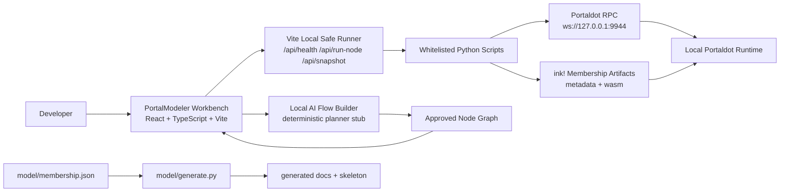
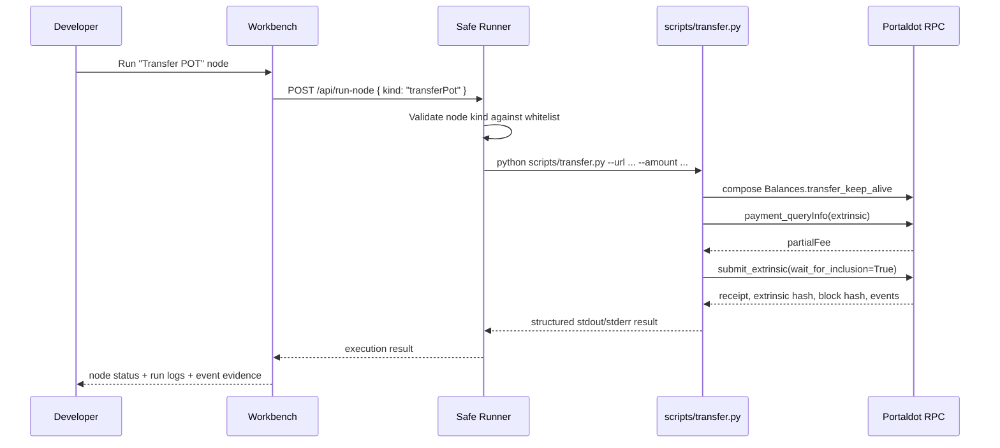
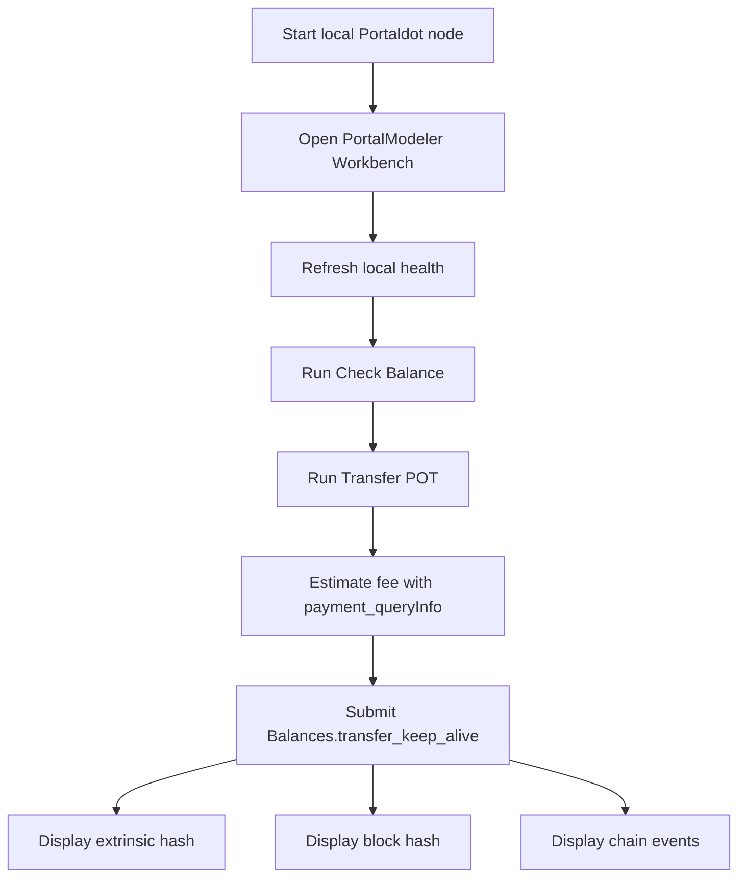

# PortalModeler


**PortalModeler is a visual Portaldot workbench that turns local blockchain actions into executable canvas nodes.**

Instead of forcing developers to jump between hidden chain state, shell scripts, fee checks, contract artifacts, and raw logs, PortalModeler puts the workflow on a board. Each node represents a concrete step: connect to a local Portaldot node, inspect account state, estimate POT fees, submit a transaction, read contract state, or export reproducible commands.

The checkpoint-critical MVP is intentionally stable and real:

```txt
Connect local Portaldot node
-> Check signer POT balance
-> Estimate POT transfer fee through payment_queryInfo
-> Submit a real Balances.transfer_keep_alive extrinsic
-> Show extrinsic hash, block hash, and chain events
```

The repository also includes an **ink! Membership contract workflow** as extended functionality for contract-oriented exploration.

## Product Snapshot

| Area | Status | Notes |
|---|---:|---|
| Local Portaldot connection | Ready | Targets `ws://127.0.0.1:9944`. |
| Balance query | Ready | Reads `System.Account` through `substrate-interface`. |
| POT fee estimate | Ready | Uses `payment_queryInfo` before submission. |
| Real on-chain action | Ready | Submits `Balances.transfer_keep_alive`. |
| Visual node workbench | Ready | React/Vite canvas with node status, logs, inspector, and command export views. |
| Safe runner | Ready | Browser can only call whitelisted local actions. No arbitrary shell execution. |
| AI Flow Builder | Prototype | Deterministic local planner that creates approved Transfer POT workflows. |
| ink! Membership flow | Extended | Build/deploy/call/read scripts are included, but Transfer POT is the primary demo path. |
| Model generator | Prototype | JSON contract/action model -> skeleton docs and contract scaffold. |

## Why It Matters

Local blockchain development often fails in boring places: wrong endpoint, stale contract address, missing artifact, low balance, unknown fee, or a script that worked yesterday but no longer matches the chain state. PortalModeler makes those invisible failure points visible.

The core idea is simple:

- **Visual first:** actions are represented as nodes instead of scattered commands.
- **Safe by design:** the frontend routes execution through a whitelist, not arbitrary shell input.
- **Proof oriented:** the MVP does one real chain action end to end and shows the fee, block, extrinsic, and events.
- **Model aware:** a small JSON model can generate docs, skeleton code, and deploy checklists.
- **Extensible:** the same node system can grow from token actions into contract lifecycle workflows.

## Architecture



### Runtime Execution Model



## Repository Layout

```txt
portaldot-proof/
|-- README.md                         # Main project documentation
|-- submission_answers.txt            # Hackathon submission draft answers
|-- PROGRESS_REVIEW_SUBMISSION.md     # Evidence and review notes
|-- DEMO_FLOW.md                      # Recommended demo script
|-- WORKBENCH_USER_GUIDE.md           # Beginner-facing workbench guide
|-- requirements.txt                  # Python dependency list
|
|-- scripts/
|   |-- common.py                     # Shared RPC, keypair, CLI helpers
|   |-- doctor.py                     # Environment and local runtime readiness checks
|   |-- query.py                      # Connect and query signer/account balance
|   |-- transfer.py                   # Estimate fee and submit Transfer POT
|   |-- run_node.py                   # Local node launcher/log bridge helper
|   |-- deploy.py                     # Deploy ink! Membership contract artifacts
|   `-- call.py                       # Call/read Membership contract messages
|
|-- front-end/
|   |-- package.json                  # React/Vite app scripts and dependencies
|   |-- vite.config.ts                # Vite config plus local safe-runner middleware
|   |-- index.html
|   `-- src/
|       |-- App.tsx                   # Main workbench, graph logic, planner, runner UI
|       |-- main.tsx
|       |-- styles.css
|       `-- assets/                   # PortalModeler images/logos
|
|-- contract/
|   |-- Cargo.toml                    # ink! Membership contract package
|   |-- rust-toolchain.toml
|   `-- src/
|       |-- lib.rs
|       `-- membership_contract.rs
|
|-- model/
|   |-- membership.json               # Contract/action model
|   `-- generate.py                   # Model -> docs/skeleton generator
|
`-- generated/
    |-- README.md
    |-- ACTIONS.md
    |-- EVENTS.md
    |-- DEPLOY_CHECKLIST.md
    `-- lib.rs
```

## Technology Stack

| Layer | Technology |
|---|---|
| Frontend | React 19, TypeScript 5, Vite 5, CSS, Lucide icons |
| Local runner | Vite middleware, Node.js child process execution with explicit whitelist |
| Blockchain scripting | Python, `substrate-interface` |
| Chain target | Local Portaldot/Substrate-compatible node over WebSocket |
| Contract | Rust, ink! 5.0.2, cargo-contract |
| Modeling | JSON model, Python code/doc generator |
| Token assumptions | POT, 14 decimals, SS58 format 42 |

## Core Demo: Transfer POT Proof

This is the primary demo flow because it is small, stable, and fully on-chain.



Expected evidence in the run logs:

- sender and recipient SS58 addresses
- transfer amount in base units and POT
- estimated fee from `payment_queryInfo`
- successful inclusion receipt
- extrinsic hash
- block hash
- events such as `Balances.Transfer` and `System.ExtrinsicSuccess`

## Quick Start

### 1. Install Python dependencies

```powershell
cd portaldot-proof
python -m venv .venv
.\.venv\Scripts\Activate.ps1
pip install -r requirements.txt
```

### 2. Install Rust and cargo-contract

```powershell
winget install Rustlang.Rustup
rustup target add wasm32-unknown-unknown
cargo install cargo-contract --locked
```

### 3. Start a local Portaldot node

Download the local Portaldot development node from the official Portaldot chain-info documentation, then start it with a development account:

```bash
portaldot_dev --dev --alice
```

The project expects the local WebSocket endpoint:

```txt
ws://127.0.0.1:9944
```

### 4. Verify local readiness

```powershell
python scripts/doctor.py --url ws://127.0.0.1:9944
python scripts/query.py --url ws://127.0.0.1:9944
```

### 5. Estimate fee without submitting

```powershell
python scripts/transfer.py --url ws://127.0.0.1:9944 --dry-run-only
```

### 6. Submit the real local Transfer POT proof

```powershell
python scripts/transfer.py --url ws://127.0.0.1:9944 --amount 1000000000000
```

The default amount is `1000000000000` base units, which is `0.010000 POT` when POT uses 14 decimals.

## Run The Visual Workbench

```powershell
cd portaldot-proof\front-end
npm install
npm run dev
```

Open the Vite URL printed in the terminal, usually:

```txt
http://localhost:5173
```

In the workbench:

1. Open the board.
2. Refresh local health.
3. Run `Check Balance`.
4. Run `Transfer POT`.
5. Inspect run logs for fee, extrinsic hash, block hash, and events.

Build check:

```powershell
cd portaldot-proof\front-end
npm run build
```

## Safe Runner API

The frontend uses Vite middleware to expose local-only endpoints during development.

| Endpoint | Method | Purpose |
|---|---:|---|
| `/api/health` | `GET` | Check RPC reachability, artifacts, and contract address state. |
| `/api/run-node` | `POST` | Execute one approved node kind through the whitelist. |
| `/api/snapshot` | `GET` | Read account, contract, state, and event timeline data for the UI. |

The runner maps node kinds to explicit commands:

| Node kind | Local action |
|---|---|
| `connectRpc`, `checkRuntime` | `python scripts/doctor.py --url <endpoint>` |
| `checkBalance` | `python scripts/query.py --url <endpoint>` |
| `transferPot` | `python scripts/transfer.py --url <endpoint> --amount <value>` |
| `buildContract` | `cargo contract build --release` in `contract/` |
| `deployContract` | `python scripts/deploy.py --url <endpoint> --fee <fee>` |
| `verifyContractLive` | `python scripts/call.py --action join_fee` |
| `readMessage` | `python scripts/call.py --action <message>` |
| `callMessage` | `python scripts/call.py --action <message> --value <value>` |
| `loadArtifact`, `attachContract` | Local file/address checks |
| `exportWorkflow`, `exportCommands`, `saveWorkflow`, `loadWorkflow`, `generateReport` | Browser/local helper outputs |

The browser never sends arbitrary shell commands to the backend. It sends a node kind and config, and the local runner decides whether that kind is allowed.

## Extended Contract Workflow

The repository includes a sample ink! Membership contract with:

- `join()`
- `join_fee`
- `is_member`
- `joined_at`
- `MemberJoined`

Build the contract:

```powershell
cd portaldot-proof\contract
cargo contract build --release
cd ..
```

Deploy:

```powershell
python scripts/deploy.py --url ws://127.0.0.1:9944 --fee 100000000000000
```

Call and read state:

```powershell
python scripts/call.py --url ws://127.0.0.1:9944 --action join --value 100000000000000
python scripts/call.py --url ws://127.0.0.1:9944 --action is_member
python scripts/call.py --url ws://127.0.0.1:9944 --action joined_at
```

Contract note: the Membership workflow is included to show the model-driven contract direction. The primary checkpoint demo remains the Transfer POT workflow because it is the most stable end-to-end proof across local runtime resets.

## Model To Skeleton Generator

PortalModeler also includes a small model-driven generator.

Input model:

```json
{
  "contract": "Membership",
  "actors": ["User", "Admin"],
  "states": [
    {
      "name": "is_member",
      "type": "Mapping<AccountId,bool>"
    },
    {
      "name": "joined_at",
      "type": "Mapping<AccountId,Timestamp>"
    }
  ],
  "actions": [
    {
      "name": "join",
      "actor": "User",
      "requires": "pay POT",
      "emits": "MemberJoined"
    }
  ],
  "events": [
    {
      "name": "MemberJoined",
      "fields": ["account", "joined_at", "paid"]
    }
  ]
}
```

Regenerate sample output:

```powershell
python model/generate.py model/membership.json --out generated
```

Generated artifacts:

- `generated/lib.rs`
- `generated/ACTIONS.md`
- `generated/EVENTS.md`
- `generated/DEPLOY_CHECKLIST.md`
- `generated/README.md`

## Portaldot Constants Used

| Constant | Value |
|---|---|
| Local websocket | `ws://127.0.0.1:9944` |
| Mainnet websocket | `wss://mainnet.portaldot.io` |
| SS58 format | `42` |
| Token symbol | `POT` |
| Token decimals | `14` |
| Default signer | `//Alice` |
| Default transfer recipient | `//Bob` |

If the local runtime does not expose token metadata through `system_properties`, the scripts fall back to the documented Portaldot defaults above.

## What Is Real vs Helper

This project is explicit about proof boundaries.

**Real local chain actions:**

- RPC connectivity check
- balance query through `System.Account`
- fee estimation through `payment_queryInfo`
- `Balances.transfer_keep_alive` submission
- extrinsic hash, block hash, and emitted chain events
- Membership contract build/deploy/call scripts where runtime compatibility is available

**Local/browser helper functionality:**

- command export
- workflow JSON export
- generated markdown report
- save/load helpers
- event helper views
- deterministic AI Flow Builder planner stub

The helper features are product affordances around the proof. The proof itself is the Transfer POT transaction and its returned chain evidence.

## Demo Script

Recommended 60-90 second demo:

```txt
1. Start local Portaldot node at ws://127.0.0.1:9944.
2. Open PortalModeler Workbench.
3. Refresh local health and show RPC online.
4. Run Check Balance and show Alice's POT balance.
5. Run Transfer POT with 0.010000 POT.
6. Zoom into logs: fee estimate, extrinsic hash, block hash, events.
7. Explain that the browser triggered a whitelisted local script, not arbitrary shell execution.
```

One-line pitch:

```txt
PortalModeler turns a visual workflow node into a real Portaldot action: it estimates POT fees, submits a local transaction, and brings the resulting extrinsic, block, and events back into the workbench.
```

## Troubleshooting

| Symptom | Likely cause | Fix |
|---|---|---|
| RPC offline | Local node is not running or endpoint is wrong | Start `portaldot_dev --dev --alice` and use `ws://127.0.0.1:9944`. |
| Balance query fails | Python dependencies or RPC unavailable | Activate `.venv`, run `pip install -r requirements.txt`, then `scripts/doctor.py`. |
| Contract address is stale | Local chain was restarted with temporary state | Redeploy or remove the stale address file before contract demo. |
| Missing metadata/WASM | Contract was not built | Run `cargo contract build --release` inside `contract/`. |
| Transfer fails | Low balance, wrong recipient, or runtime mismatch | Query balance, verify endpoint, and retry with the default dev accounts. |
| Token metadata missing | Local runtime returns empty `system_properties` | Scripts use Portaldot docs defaults: `POT`, 14 decimals. |

## References

- Portaldot docs home: https://portaldot-dev.readthedocs.io/en/latest/
- Local development network: https://portaldot-dev.readthedocs.io/en/latest/getting-started/local_test.html
- Chain info: https://portaldot-dev.readthedocs.io/en/latest/chain-info.html
- Python SDK install: https://portaldot-dev.readthedocs.io/en/latest/python-sdk/Install.html
- Create and call ink! contract: https://portaldot-dev.readthedocs.io/en/latest/python-sdk/Examples.html#create-and-call-ink-contract
- ink! contract interfacing: https://portaldot-dev.readthedocs.io/en/latest/python-sdk/usage/ink-contract-interfacing.html
- Contracts extrinsics: https://portaldot-dev.readthedocs.io/en/latest/module-interface/extrinsics/contracts.html
- Contracts events: https://portaldot-dev.readthedocs.io/en/latest/module-interface/events/contracts.html
- Contracts storage: https://portaldot-dev.readthedocs.io/en/latest/module-interface/storage/contracts.html

## Current Scope

PortalModeler is a hackathon proof, not a production wallet or general workflow engine. The current version focuses on one credible end-to-end local Portaldot proof, a visual execution surface, and a safe path for extending node-based contract workflows.
